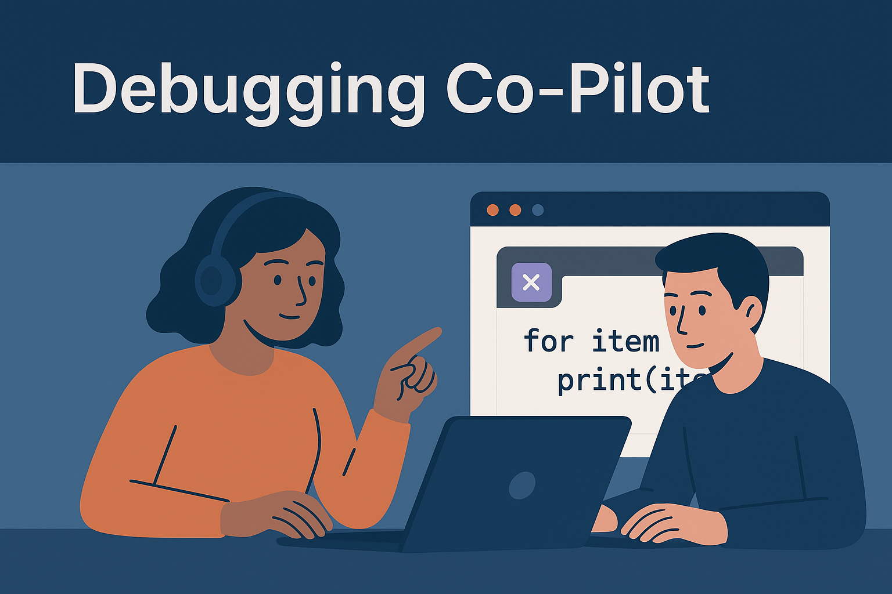
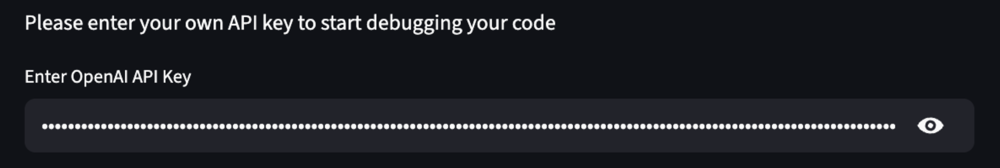
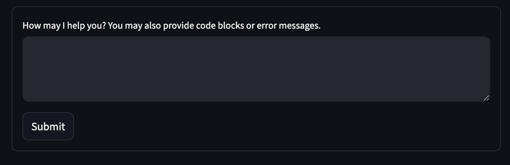
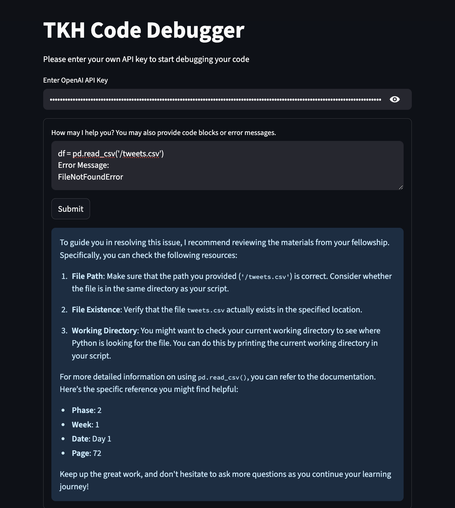

## Project Overview
Debugging Co-Pilot is a prototype we are building to help data science students like us, fix coding bugs in Python and SQL faster without getting stuck. The idea is to give hints and explain things in simple language instead of just showing the answer, so students can actually learn while solving their errors. 

### Code and Resources Used
Editor used: VS Code
Python Version: 3.12

### Python Packages Used
General Purpose packages: os, load_env
Vectorization: Chroma from langchain_community.vectorstores, OpenAI Embeddings from Langchain AI
Artificial Intelligence: From OpenAI

### Data Sources
Knowledge House slides from Foundations to the end of Phase 2.

### Code structure
Pip install Langchain/chroma
Pip install dotenv
Imports/ Open Ai instance
Pdf load ins
Pdf Vectorization
Study Buddy Test Cases

### Results and evaluation
We used these four questions to evaluate how close our prototype is to the desired output.
Does the resource or link point to the right content that is needed to solve the issue?
Does our AI agent give the answer away?
Is the agent’s explanation correct and understandable?
Are the explanations similar from running the same prompts twice?  

Overall our prototype worked as intended. Based on our tests our model points the student to the correct slides 9/12 times. We believe the inaccuracies stem from not having the appropriate data to reference. Our model never gives students the answer away. The explanations are correct and understandable except for when there isn’t proper documentation to reference. Our model also gives similar answers pretty consistently but we have found that sometimes on repeat runs of code the prototype gives more resources to help debug. In test case 10, on the first run our model only provided Phase 1, Week 8, Day 1, Page 25 and on the 2nd it provided Phase 1, Week 8, Day 3 and the resource above.

### Future work
In the future we’d like to add more data so our model can more easily find the correct code to reference. We’d also like to make our co-pilot fluent in more coding languages.

## How to run Streamlit application locally

### 1. Clone the repository

```
git clone https://github.com/your-username/debugapp.git
cd debugapp
```

### 2. Activate a virtual environment
Mac/Linux:

```
python3 -m venv .venv
source .venv/bin/activate      
```   

Windows:
```
python -m venv .venv
.venv\Scripts\activate 
```

### 3. Install dependencies
```
pip install streamlit==1.48.0 openai==1.99.9 langchain==0.3.27 langchain-core==0.3.74 langchain-community==0.3.27 langchain-openai==0.3.31 chromadb==1.0.20 python-dotenv
```

### 4. Run Streamlit App
```
# Mac/Linux
.venv/bin/python -m streamlit run tkhdebugger.py

# Windows
.venv\Scripts\python.exe -m streamlit run tkhdebugger.py
```

### 5. Open in browser
http://localhost:8501

### 6. Enter your Open API key in the application


### 7. Ask away! 


### 8. When done running, deactivate virtual environment 
deactivate 

## Example


